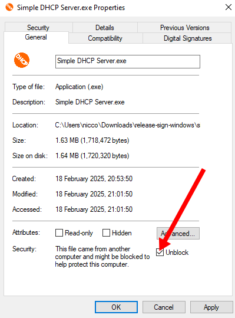

# Simple DHCP Server

[Download][releases]

This is a purely Python DHCP server that does not require any additional libraries or installs other that Python 3.

It was testet under Ubuntu 14 with Python and Windows 7. It does not use any operating system specific Python functions, so it should work when Python 3 works.

  
dhcpgui lists MAC address, IP address and host name.

This DHCP server program will assign IP addresses ten seconds after it received packets from clients. So it can be used in networks that already have a dhcp server running.

This Python DHCP server

- shows clients in the network
- lists IP address, Mac address and host name
- highlights recently refreshed/added clients
- assigns IP addresses 10 seconds later than usual DHCP servers
- remembers addresses in the `hosts.csv` file.
- can be configured to serve all DHCP options using Python

Contributions welcome!
If you find a bug, please open an [issue].

## Windows

You can install this software by downloading the [release][releases] named `Simple-DHCP-Server-Windows-X.Y.Z.zip` file.
Unpack the zip file, you will find an executable `.exe` file inside.

You might need to unblock the file:



## Linux

There are several ways to install this under Linux:

### QT

You can use the new QT GUI:

```sh
pip install simple-dhcp-server[qt]
```

Start:

```sh
sudo simple-dhcp-server-qt
```

### Tkinter

You can use the old Tkinter GUI:

```sh
sudo apt-get install python3 python3-tk
pip install simple-dhcp-server
```

Start:

```sh
sudo simple-dhcp-server-tk
```


## Changelog


[releases]: https://github.com/niccokunzmann/python_dhcp_server/releases
[issue]: https://github.com/niccokunzmann/python_dhcp_server/issues
